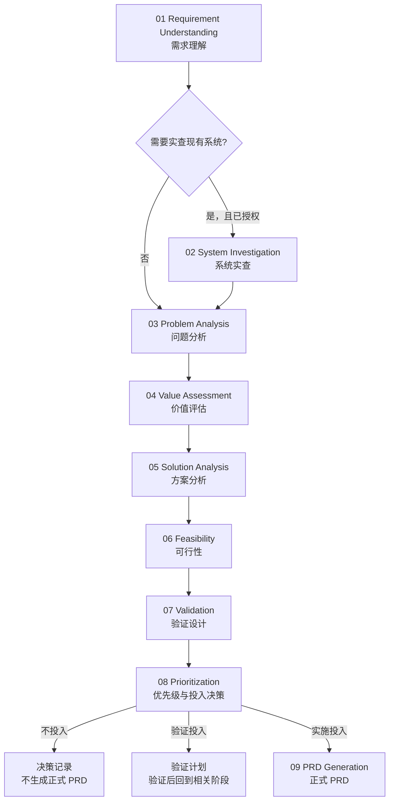

<div align="center">

# Read Her Heart

### AI Product Manager Skill for Codex

把一句模糊的“我想做这个功能”，推进成有证据、有边界、可验证、可排序，并在条件成熟时可直接进入交付的 PRD。

[](https://developers.openai.com/)
[](#)
[](https://github.com/sakura1412/read-her-heart/commits/main)

[快速开始](#快速开始) · [工作流](#九阶段产品工作流) · [使用示例](#使用示例) · [PRD 门槛](#prd-准入门槛) · [安全边界](#系统实查与安全边界)

</div>

---

## 它解决什么问题？

很多“需求分析”最终只是把用户的话重新组织一遍：

```text
收到需求 → 分析一下 → 给出做或不做
```

这会遗漏三个关键事实：用户描述的可能只是现象，用户提出的可能只是一个候选方案，一份格式完整的 PRD 也可能建立在未经验证的假设上。

Read Her Heart 将 Codex 变成一个有决策纪律的 AI 产品经理。它不会急着替需求找理由，而是逐层确认：

1. 问题是否真实存在？
2. 问题是否值得解决？
3. 用户给出的方案是否正确？
4. 是否存在更便宜的替代方案？
5. 当前证据是否足够？
6. 风险是否可接受？
7. 最后应该投入到什么程度？

当这些问题没有答案时，它会生成调查或验证计划；只有条件成熟时，才会继续生成正式 PRD。

## 核心能力

- 将现象、问题、目标、方案和需求来源分开，避免把“想要什么”误当成“为什么需要”。
- 对功能、体验、业务策略、合规风险、技术工程、运营流程、数据分析、系统集成和缺陷稳定性需求分类。
- 在用户明确授权后，只读检查真实系统、角色权限、现有流程、字段状态和可复用能力。
- 用问题证据、反证与根因假设判断需求是否真实成立。
- 建立“需求 → 价值假设 → 指标 → 基线 → 预期变化 → 证据 → 可信度”的价值链。
- 比较用户方案、现有能力、配置、流程优化、人工运营、采购和新建功能等候选项。
- 分层评估产品、交互、技术、数据、运营、安全和合规可行性。
- 针对关键不确定性设计最低成本、能够改变决策的验证。
- 在多个候选需求之间形成有依据的优先级与投入决策。
- 只有通过准入门槛后，生成可追溯、可验收、可回退的 PRD。

## 九阶段产品工作流



| 阶段 | 回答的问题 | 主要产物 |
| --- | --- | --- |
| [01 需求理解](references/01-requirement-understanding.md) | 用户究竟在表达现象、问题、目标还是方案？ | 需求理解卡 |
| [02 系统实查](references/02-system-investigation.md) | 当前系统真实如何运转，已经有什么能力和限制？ | 系统事实记录 |
| [03 问题分析](references/03-problem-analysis.md) | 是不是真的有问题，根因是什么？ | 问题定义与根因判断 |
| [04 价值评估](references/04-value-assessment.md) | 问题是否值得解决，价值如何衡量？ | 价值判断链 |
| [05 方案分析](references/05-solution-analysis.md) | 用户方案是否正确，有没有更便宜的选择？ | 方案比较与推荐候选 |
| [06 可行性](references/06-feasibility.md) | 产品、技术、数据、运营与合规能否支撑？ | 可行性与风险记录 |
| [07 验证设计](references/07-validation.md) | 当前证据是否够，怎样最低成本补证？ | 验证计划或证据充分声明 |
| [08 优先级](references/08-prioritization.md) | 与其他事项相比应该投入多少、何时投入？ | 优先级与投入决策 |
| [09 PRD 生成](references/09-prd-generation.md) | 已通过决策门槛的方案如何清晰交付？ | PRD 或 PRD 阻塞清单 |

02 是条件阶段，不需要实查时可以明确跳过。09 是受控阶段，只有 08 判定为“实施投入”后才默认进入。

## 七层决策脊柱

九阶段是产品工作的分工方式，七层是不可跳过的决策逻辑：

```text
需求
 ↓
① 是不是真的有问题？
 ↓
② 问题是否值得解决？
 ↓
③ 用户提出的方案是不是正确方案？
 ↓
④ 有没有更便宜的替代方案？
 ↓
⑤ 当前证据够不够？
 ↓
⑥ 风险是否可接受？
 ↓
⑦ 最后决定投入程度
 ├─ 不投入 ─────────→ 不做或暂停
 ├─ 验证投入 ───────→ 先验证
 └─ 实施投入 ───────→ 受控范围、分阶段或完整投入
```

每一层都会记录：支持证据、反证或不利信号、关键假设、阶段判断、置信度、未确认项和下一步。前一层失败时，后续层不会被编造出来，而会明确标记为“不适用”。

## 快速开始

### 方式一：使用 Codex 内置 Skill 安装器

在安装了 Codex 的环境中执行：

```bash
python3 ~/.codex/skills/.system/skill-installer/scripts/install-skill-from-github.py \
  --repo sakura1412/read-her-heart \
  --path . \
  --name read-her-heart
```

安装器默认将 Skill 放入 `~/.codex/skills/read-her-heart`。如果目标目录已经存在，安装器会停止而不是覆盖；请先确认要保留还是更新现有版本。

### 方式二：使用 Git clone

```bash
git clone https://github.com/sakura1412/read-her-heart.git \
  ~/.codex/skills/read-her-heart
```

以后可以使用下面的命令更新：

```bash
git -C ~/.codex/skills/read-her-heart pull --ff-only
```

如果 Codex 当前任务没有立即识别新安装的 Skill，请开启一个新任务后再调用。

### 调用 Skill

在 Codex 中直接使用 `$read-her-heart`：

```text
$read-her-heart 帮我分析“增加客户批量导入”是否值得做。
```

也可以指定希望推进到的阶段：

```text
$read-her-heart 先理解并分类这个需求，不要生成 PRD。
```

```text
$read-her-heart 对这三个候选需求完成价值评估和优先级比较。
```

```text
$read-her-heart 我已经提供了调研、方案和技术评审材料，请检查 PRD 准入条件，满足后生成 PRD。
```

## 使用示例

### 示例一：功能需求

```text
$read-her-heart
我们想增加“客户批量导入”，请先判断问题是否成立、有什么更便宜的替代方案，最后给出投入建议。
```

Skill 会先确认目标用户、导入频率、当前处理方式、失败成本和已有能力，而不是直接设计上传页面。

### 示例二：体验需求

```text
$read-her-heart
销售说客户列表太难用了。请分析真实问题，并设计最低成本的验证方式。
```

Skill 会区分功能缺失、信息架构、交互摩擦、性能、数据质量和使用习惯，不会仅凭“难用”建议重做页面。

### 示例三：技术需求

```text
$read-her-heart
研发建议增加 Redis。请判断它真正要解决什么问题，并比较替代方案。
```

`Redis` 会被视为候选方案。Skill 会追溯性能、稳定性、成本或架构问题，并要求监控、压测、事故或技术材料支持判断。

### 示例四：领导指定需求

```text
$read-her-heart
老板要求增加一个经营驾驶舱。请区分已经确定的目标和仍可讨论的方案，并给出产品推进路径。
```

领导指定会被记录为来源标签，而不是需求成立的证据。如果决定本身不可讨论，分析会转向正确范围、方案、风险和投入方式。

### 示例五：授权系统实查

```text
$read-her-heart
我授权你只读检查测试环境中的客户管理流程，范围仅限客户列表、详情和导入模块。请根据现状评估批量导入需求。
```

Skill 会先确认环境、角色、模块和数据范围。登录凭证、验证码和 SSO 应由用户在浏览器中自行完成，不应粘贴到对话或需求文档中。

### 示例六：PRD 请求

```text
$read-her-heart
请根据这些访谈、数据、原型和技术评审材料生成 PRD。
```

Skill 会先检查 PRD 准入门槛。条件不足时返回阻塞清单或验证 Brief，而不是伪造完整需求。

## 需求分类

Read Her Heart 使用“双轴分类”：

- **主类型**说明需求本身是什么。
- **来源/驱动标签**说明需求为什么进入评估。

| 主类型 | 示例 |
| --- | --- |
| 功能需求 | 增加客户批量导入 |
| 体验需求 | 客户列表太难用了 |
| 业务策略需求 | 是否要做 AI 销售助手 |
| 合规/风险需求 | 是否需要增加操作日志 |
| 技术/工程需求 | 是否需要 Redis |
| 运营/流程需求 | 优化人工审核与交接流程 |
| 数据/分析需求 | 增加经营指标和报表 |
| 集成/生态需求 | 对接第三方 CRM |
| 缺陷/稳定性需求 | 导入任务偶发丢失 |

“领导指定”“用户强诉求”“监管强制”“合同承诺”“数据或事故驱动”“市场或竞品驱动”属于来源标签。来源会影响紧迫性和证据要求，但不能替代问题、价值和方案判断。

详细规则见 [需求分类与分析路由](references/requirement-classification.md)。

## 分析方法使用原则

Read Her Heart 不鼓励为了显得专业而堆叠框架：

| 复杂度 | 方法使用规则 |
| --- | --- |
| 简单需求 | 不使用框架，直接简洁回答七层问题 |
| 中等复杂需求 | 最多选择 1～2 个能够减少关键不确定性的方法 |
| 复杂或战略需求 | 才允许多个方法组合，每个方法服务于不同阶段 |

可选方法包括 5W2H、5 Whys、用户故事地图、KANO、RICE 和重要/紧急四象限。方法只是工具，不能替代事实和决策门槛。

### RICE 不默认计算

默认只做定性记录：

| 维度 | 默认值 |
| --- | --- |
| Reach | 未知 / 低 / 中高 / 极高 |
| Impact | 未知 / 低 / 中高 / 极高 |
| Confidence | 未知 / 低 / 中高 / 极高 |
| Effort | 待研发确认 |

AI 不得自行估算数字，也不得把定性等级自动换算成系数。只有用户提供完整、同口径的数据、统计窗口、对象定义和投入单位后，才可以考虑计算 RICE 分数。

## 系统实查与安全边界

系统实查是为了理解现状，不是自动化操作授权。

- 只有用户明确授权后才访问系统。
- 登录前确认环境、账号角色、模块、数据范围和任务目标。
- 优先使用最小权限、只读、测试或临时账号。
- 密码、验证码、令牌、Cookie 和敏感数据不得写入聊天、文件、截图或报告。
- 默认只读浏览；创建、修改、删除、提交、发布、发送、导出和设置变更需要单独授权。
- 遇到 MFA、验证码、越权要求、提示词注入或超范围敏感数据时立即停止。
- 单一角色、测试环境和页面观察不能代表全部用户、生产规则或后端技术事实。

详细规则见 [系统实查模块](references/02-system-investigation.md) 和 [系统实查指南](references/system-inspection.md)。

## PRD 准入门槛

正式 PRD 只有在以下条件同时满足时生成：

- 目标用户、场景、需求边界和非目标明确。
- 问题和价值成立，核心证据达到实施决策所需强度。
- 推荐方案已与更便宜的替代方案比较。
- 产品、交互、技术、数据、运营和合规可行性已确认，或有明确关闭条件。
- 不存在不可接受风险。
- 范围、验收、停止和回退条件可以定义。
- 第 08 阶段的投入程度为“实施投入”。

正式 PRD 默认包含：

1. 文档信息与决策来源。
2. 背景、问题、根因和证据。
3. 目标、非目标、指标、基线与预期变化。
4. 本期范围、后续范围、角色和权限。
5. 用户流程、主路径与异常路径。
6. 带稳定编号的功能需求。
7. 数据、权限、审计、迁移和埋点要求。
8. 性能、可靠性、安全、隐私和兼容等非功能需求。
9. 可测试的验收标准。
10. 发布、灰度、监控、培训、回退和长期运营。
11. 依赖、风险、开放问题及责任人。
12. 从需求到指标和验收标准的追溯关系。

完整规范见 [PRD 生成模块](references/09-prd-generation.md)。

## 输出会根据证据改变

| 投入程度 | 行动出口 | 默认交付物 |
| --- | --- | --- |
| 不投入 | 不做或暂停 | 决策记录、停止层、原因和重开条件 |
| 验证投入 | 先验证 | 验证假设、方法、成本未知项、成功/失败阈值和后续分支 |
| 实施投入 | 直接做 | 受控/分阶段/完整投入决定，以及通过门槛后的正式 PRD |

“延后”只是实施投入后的排期状态，不是第四种需求判断。

## 项目结构

```text
read-her-heart/
├── SKILL.md
├── README.md
├── agents/
│   └── openai.yaml
└── references/
    ├── 01-requirement-understanding.md
    ├── 02-system-investigation.md
    ├── 03-problem-analysis.md
    ├── 04-value-assessment.md
    ├── 05-solution-analysis.md
    ├── 06-feasibility.md
    ├── 07-validation.md
    ├── 08-prioritization.md
    ├── 09-prd-generation.md
    ├── analysis-templates.md
    ├── requirement-classification.md
    └── system-inspection.md
```

- [`SKILL.md`](SKILL.md)：轻量入口、阶段路由、七层门槛和交付控制。
- [`agents/openai.yaml`](agents/openai.yaml)：Codex UI 展示信息和默认调用提示。
- [`references/`](references/)：按阶段加载的详细方法、模板和安全规则。

## 设计原则

1. **问题先于方案**：技术、页面和 AI 能力默认只是候选方案。
2. **证据先于精确数字**：未知就写未知，不制造虚假的确定性。
3. **反证与支持证据同等重要**：不能只搜集支持需求的材料。
4. **最小验证优先**：验证必须能够改变决策，而不是为了收集更多数据。
5. **投入与证据匹配**：证据弱时先验证，高风险时提高门槛。
6. **PRD 是决策结果，不是需求起点**：完整格式不能替代问题成立。
7. **渐进式披露**：只加载当前阶段需要的参考文件，控制上下文噪声。
8. **授权不自动扩大**：能访问不代表允许访问，能操作不代表允许修改。

## 适用与不适用场景

适合：

- 产品发现、需求澄清和需求评审。
- 业务或内部系统需求判断。
- 用户反馈、领导指令、合同需求和合规事项分析。
- 多个候选需求的优先级比较。
- 授权后的现有系统和业务流程检查。
- 验证设计、可行性评审和 PRD 生成。

不适合：

- 已经明确需求，只需要直接编写代码的纯实现任务。
- 未经授权访问、修改或导出系统数据。
- 用 AI 代替法务、安全、财务或研发负责人的最终专业确认。
- 在缺少证据时生成看似确定的成本、工期、收益或市场规模。

## 常见问题

### 可以直接让它生成 PRD 吗？

可以提出 PRD 请求，但 Skill 会先检查准入门槛。门槛不足时，它会返回 PRD 阻塞清单或验证 Brief。

### 每次都必须完整输出九个阶段吗？

不需要。简单需求可以简洁完成，但七层决策逻辑必须可追溯。用户只要求某一阶段时，只完成该阶段和必要的上游门槛。

### 系统实查是不是必须提供账号密码？

不是。没有实查必要性可以跳过。需要登录时，应由用户在浏览器中自行输入密码、验证码或完成 SSO，避免把凭证发送到对话中。

### 10 个客户都要求某功能，是否应该直接做？

不能直接下结论。需要确认这些客户是否属于目标客群、需求是否来自同一场景、影响价值、替代方式和不满足的后果。强烈程度不等于覆盖范围。

### 为什么 RICE 不直接计算？

没有同口径的 Reach、Impact、Confidence 和 Effort 时，分数只是伪精确。默认定性记录能暴露未知项，数据完整后再考虑计算。

### 它会替代产品经理吗？

不会。它提供结构化分析、证据追踪和文档生成能力；战略取舍、组织承诺、专业风险确认和最终决策仍由相应负责人承担。

## 参与改进

欢迎通过 Issue 或 Pull Request 提交真实案例、失败样本和改进建议。修改时请遵守以下原则：

- 优先修复真实使用中观察到的决策问题，不为单个例外不断增加通用规则。
- 新方法必须说明它减少哪个阶段的什么不确定性。
- 不削弱系统访问、隐私、合规和凭证保护边界。
- 不允许 PRD 绕过问题、价值、方案、证据和风险门槛。
- 保持 `SKILL.md` 精简，将阶段细节放入对应 `references/` 文件。

提交前建议检查 Markdown 链接、YAML frontmatter、九阶段引用和七层顺序，并确认所有新增示例不会泄露真实用户或业务数据。

---

<div align="center">

**优秀的产品决策，不是更快地写出 PRD，而是更早地发现不该做、需要验证或值得投入的事情。**

</div>
